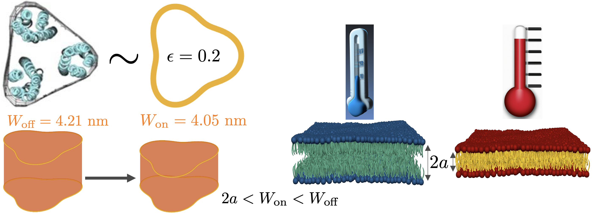


  Research


 


  Thermosensing through membrane mechanics




> 
    We can model a chemoreceptor as a button with a 3-leaf clover cross-section shape in a bilayer with mechanical properties, including unperturbed thicknesses, that are dependent on temperature. (image credits: left side image with chemoreceptor structure and shape model comes from [Liu et. al., 2012, Haselwandter and Wingreen, 2014] and right side with warmer temperature decreasing bilayer thickness concept is from [Pan et. al., 2008] where we created the warm and cold bilayer images with Blender.)
  

 




  APS March Meeting 2023 talk in Las Vegas, NV



 



  Living organisms are inherently attuned to their ever-changing surroundings, relying on a plethora of environmental cues to orchestrate vital biological processes. Among these cues, temperature is a crucial factor, exerting a significant influence on cellular physiology. The capacity to detect and respond to temperature variations is essential for survival, enabling organisms to thrive in diverse thermal environments. For instance, many cells employ temperature as a critical determinant in decision-making processes. Many microorganisms utilize temperature as a cue for optimal growth conditions, adjusting not only their metabolic activities but also their motion to flourish within specific thermal niches [Paulick et. al., 2017]. Moreover, extreme cold temperatures can inhibit vital cellular processes, leading organisms to employ thermosensory mechanisms to evade or adapt to adverse conditions. Conversely, excessive high temperatures can pose a severe threat to cell viability, necessitating rapid responses to mitigate the damaging effects of extreme warmth. In recent decades, a diverse range of experiments have significantly advanced our understanding of how organisms perceive and respond to environmental cues, particularly temperature fluctuations. This progress has been punctuated by the identification of key molecular players, including temperature and touch transmembrane protein sensors, that play pivotal roles in these sensory processes. While these insights have provided valuable pieces of the puzzle, the precise physical mechanisms governing temperature sensing at the molecular level continue to be elusive.

 

   In recent decades, extensive research has uncovered the mechanical properties of cellular membranes, revealing a coupling between protein function and membrane mechanics. These specialized proteins, often called mechanosensors, couple to membrane mechanical properties such as membrane thickness and rigidity. Additionally, various lines of experimental research suggest that biological membranes, typically considered soft materials, exhibit substantial changes as temperatures rise, making them easier to deform and thinner [Pan et. al., 2008]. While our quantitative understanding of the effect of temperature changes on membrane deformability continues to evolve, available evidence, albeit limited, permits a basic quantification of the relationship between temperature and membrane mechanical properties within physiologically relevant temperature ranges. This interplay between protein functionality and membrane mechanics, influenced by temperature, suggests that cells might possess the inherent capacity to detect temperature variations through membrane mechanics. On this basis, we develop a basic framework  allowing quantification of the potential consequences of temperature fluctuations on membrane mechanics and protein conformational states. In the scope of our investigation, membrane elasticity theory [Alas and Haselwandter, 2023] serves to establish a direct link between the mechanics of the lipid bilayer and the functional behavior of membrane proteins. Notably, different conformational states of membrane proteins often yield distinct protein-induced membrane deformations, with resultant changes in the energy of bilayer-protein interactions. On this basis, we employ membrane elasticity theory to connect measured temperature-dependent changes in bilayer mechanical properties to transitions in protein conformational state.

 

We propose and develop a physical mechanism, based on protein-membrane mechanics, for the ability of cells to sense temperature changes, and illustrate and test this mechanism in the context of three distinct bacterial and eukaryotic membrane proteins. In particular, we systematically explore the impact of temperature changes on the energetic cost of protein-induced lipid bilayer deformations. We introduce a simple and straightforward temperature-dependent protein-membrane mechanical model, grounded in empirical data on phospholipid membranes. This model lays the foundation for understanding how temperature influences protein-induced bilayer deformations. We also demonstrate how to model transitions in protein shape, providing a framework for studying how temperature affects protein functionality. Our results reveal that changes in temperature can yield shifts in the transition energies of chemoreceptors on the same order of magnitude as shifts due to methylation and produce significant shifts in the activation thresholds of MscL and Piezo ion channels, in line with temperature experiments on chemoreceptors, MscL, and Piezo [Shimizu et. al., 2012, Paulick et. al, 2017].

 

We are in the process of finalizing our results in manuscript.
