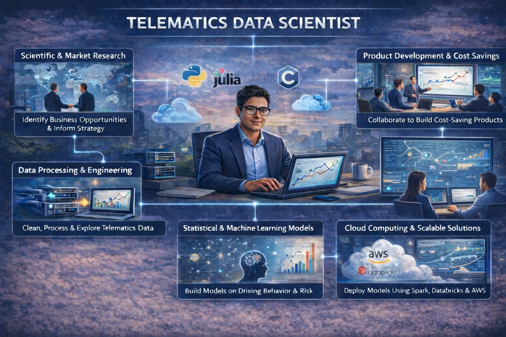


  Data Science


 


  Telematics


 



> 
    As a telematics data scientist, I conduct research on driving data and market trends to guide our business partners on product strategy. On the R&D side, I build predictive models and perform analysis using cloud computing tools — including AWS, Databricks, and Spark. On the business side, I conduct market research to develop product strategies informed by findings from our models and analysis. In practice, the role spans data analysis, data modeling, and product strategy.
  
 


Telematics in insurance is a relatively young field — barely twenty-five years old. When I set out to study it, I approached it the same way I had approached cellular signal transduction in biophysics, another discipline that was still finding its footing when I entered it: trace the field from its roots to its frontiers, read everything, and let the science guide the strategy.

 

I began by tracing the development of telematics from its technological origins — satellite navigation and on-board diagnostics — through the evolving political landscape that formed and shaped the field into what it is today. From there, I turned to the study of driving behaviors and their relationship to risk, drawing on both market research and the scientific literature. I read every paper I could get my hands on. I studied the markets themselves — the product strategies companies have used to target population segments and capture market share, and the difficulties the industry is having in scaling to greater data resolution.

 

Through the study of risk and driving behaviors, I've come to understand how to better quantify the relationship between our customers' exposure to risk and the way they actually drive, using our data. I've also explored theoretical models that bring physical understanding to why drivers exhibit certain driving behaviors in the first place.

 

Using these insights, I've increased productivity in our data analysis pipeline by 90 percent to address business needs, and introduced product strategies aimed at traditionally alienated driver populations — allowing for the capture of new market share and significantly increasing our book of business.

 

In these pages, I overview what I've come to understand about the field: its history, its current politics, and the next generation of metrics and models that will shape telematics as it revolutionizes the way drivers are priced by insurers — in such a way that democratizes premiums and gives drivers a say in how safe they really are.

 


Table of Contents

 


1. <a href="/data-science/telematics/history/">Industry History</a> — Thirty years behind the wheel: how telematics grew from a Cadillac gimmick into the force reshaping auto insurance.

