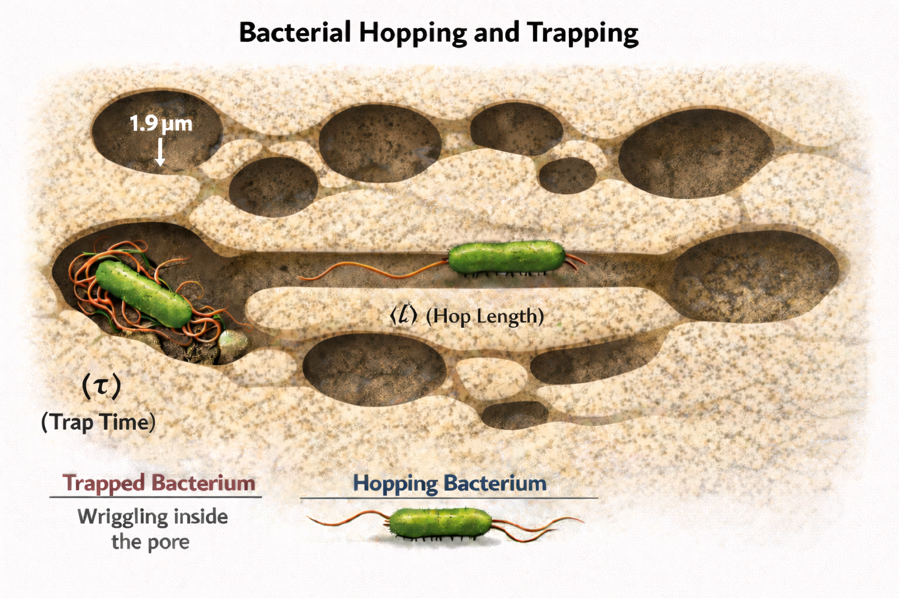
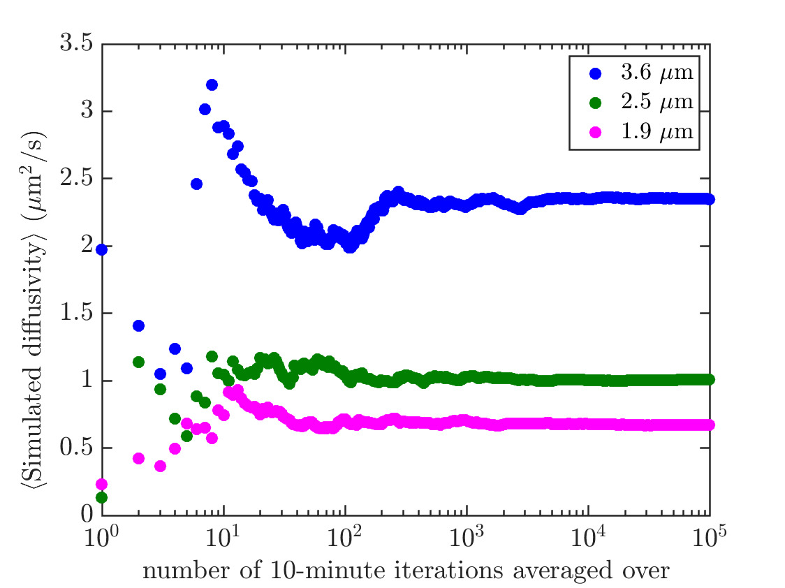


  Research


 


  Bacteria in porous media: Kinetic Monte Carlo model


<!-- Main figure showing bacteria hopping and trapping in porous media -->



> 
    Cartoon diagram visualizing the hopping and trapping motion of bacteria in porous media. Bacteria swim or "hop" in straight trajectories with mean hop length ⟨ℓ⟩ determined by the mean chord (channel) length of the porous medium, until they become "trapped" by pore confinement. While trapped, they spend a mean time ⟨τ⟩ reorienting to escape the pore before hopping again in a new direction.
  

 

  In homogeneous environments, flagellated bacteria swim using a two-state motion called "run-and-tumble." The bacterium runs in a straight direction for several body lengths by bundling and rotating its flagella, then tumbles by unraveling the bundle, causing it to slow down and reorient in a new random direction. This allows bacteria to sample their environment and construct gradients of food sources or specific chemicals. In this motion, the run time is typically much longer than the tumble time, so diffusion can be estimated from the average run length and run time.

 

  However, in porous media, flagellated bacteria employ a different two-state motion called "hopping-and-trapping" [Bhattacharjee & Datta, 2019]. The bacterium swims or "hops" in a straight direction until it becomes stuck or "trapped" due to confinement by neighboring pores. While trapped, the bacterium reorients and moves off in an almost random direction, with a slightly higher probability of returning in the direction it came from (though I assume uniform reorientation for simplicity). Bacteria spend significantly more time trapped than hopping. Therefore, estimation of their diffusivity through porous media can be obtained from the average hop length ⟨ℓ⟩ and trapped time ⟨τ⟩, rather than the hop time as in homogeneous "run-and-tumble" motion.

 

  The motion of flagellated bacteria through porous media was observed and measured in porous distributions with characteristic pore sizes of (a) 3.6 µm, (b) 2.5 µm, and (c) 1.9 µm [Bhattacharjee & Datta, 2019]. It was observed that smaller pore sizes increased the effects of pore confinement - in smaller pore size distributions, bacteria experience more trapping and less hopping. The experimenters measured the velocity distributions of bacteria and set the threshold between hopping and trapping states at half the measured run velocity in a homogeneous domain (14 µm/s). They found that varying this threshold between 8 and 20 µm/s had little effect on their results.

 

  The group measured distributions of hopping lengths and reported mean values ⟨ℓ⟩ of (a) 3.24 µm, (b) 2.79 µm, and (c) 2.14 µm, as well as distributions of trapped times. They also reported measured diffusivities of (a) 2.0 ± 0.25 µm²/s, (b) 1.0 ± 0.25 µm²/s, and (c) 0.5 ± 0.25 µm²/s. They compared their measurements to a simple random walk model where the diffusivity DRW is given by:

 


  DRW = ⟨ℓ⟩² / (3⟨τ⟩)


 

  From their predicted diffusivities of (a) 7 µm²/s, (b) 3 µm²/s, and (c) 2 µm²/s, and the relation above, I estimated the mean trapped times ⟨τ⟩ as approximately (a) 0.5 s, (b) 0.86 s, and (c) 0.76 s.

 

  Subvolume Kinetic Monte Carlo Method

 

  I developed a subvolume kinetic Monte Carlo (KMC) method that samples distributed hop lengths and trapped times from Poisson distributions. This method is an adaptation of the standard subvolume KMC approach, allowing for sampling of hop length ℓ distributions. Similar to conventional subvolume KMC, the method samples the time spent in a lattice cell before hopping to another state (the trapped time τ), then samples a reorientation direction and hop length.

 

  I applied this method to study bacterial diffusion in porous media. To simulate diffusivity, I tracked a single bacterium in a 3D lattice domain. At each iteration, the bacterium occupies a trapped state while reorienting to hop to another trapped state. I ignore hop times and only consider trapped times, as hop times are negligible compared to trapped times. At each iteration, I sample a trapped time from a Poisson distribution with mean set to half the average trapped time ⟨τ⟩/2 (I found this choice significantly improved my diffusivity predictions). I then sample a reorientation direction from a uniform distribution and sample a hop length from a Poisson distribution fitted to the mean hop length ⟨ℓ⟩.

 

<!-- Side-by-side diffusivity plots -->

  

    
    <blockquote>
    
      <strong>(a)</strong> Simulated diffusivities for bacteria in porous media with pore sizes of 3.6 µm, 2.5 µm, and 1.9 µm, averaged over 100,000 10-minute KMC simulations.
    
    </blockquote>
  

  

    
    <blockquote>
    
      <strong>(b)</strong> Comparison of my mean simulated diffusivities to experimentally measured diffusivities from Bhattacharjee & Datta (2019). The linear fit (slope = 0.88) demonstrates fair agreement within the error bounds of the experiments across different pore sizes.
    
    </blockquote>
  

 

  Results

 

  I simulated the diffusion of a single bacterium in porous media with pore distributions of sizes (a) 3.6 µm, (b) 2.5 µm, and (c) 1.9 µm for 10 minutes per KMC iteration. My results, averaged over 10⁵ iterations, yielded diffusivities of (a) 2.3 µm²/s, (b) 1.0 µm²/s, and (c) 0.67 µm²/s. These results reflect the effects of pore confinement on bacterial diffusion rates through porous media, where smaller pore size distributions result in more pore confinement and slower diffusion.

 

  Comparing my simulated diffusivities to the experimentally measured values [Bhattacharjee & Datta, 2019], I found that my simulations yielded diffusivities approximately (0.88 ± 0.14) times the measured values - about 14% higher on average. This is quite good considering that hop times and detailed reorientation direction distributions were ignored in my model. The measured diffusivities were reported to the nearest 0.5 µm²/s, so my simulated values for pore sizes 1.9 µm and 2.5 µm agree quite well within this level of experimental precision. My simulated diffusivity for 3.6 µm pores is closer to 2.5 µm²/s than the reported measured value of approximately 2.0 µm²/s, which I attribute to bacteria spending less time trapped and more time hopping in larger pores.

 

  Since my model assumes hopping time to be negligible, I always underestimate the total transition times and therefore my simulated values systematically overestimate the measured diffusivities. Despite this limitation, the agreement between simulation and experiment demonstrates that this subvolume KMC approach effectively captures the essential physics of bacterial transport in porous media.

 

  Videos

 

For visual demonstrations of bacterial hopping and trapping in porous media, see these videos from the Datta Lab:

 



 



 

  For more details, please see my <a href='/uploads/KMC_Bacteria_Hopping_And_Trapping.pdf'>project notes</a> or visit the <a href='https://github.com/cdalas2/KMC_Diffusion_In_Inhomogenous_Media_Projects'>GitHub repository</a> for the full implementation.

 

  Note: I did not work with the Datta Lab on this project. I developed this kinetic Monte Carlo model independently and find their experimental work on bacterial hopping and trapping in porous media particularly interesting as a basis for validating computational approaches.

